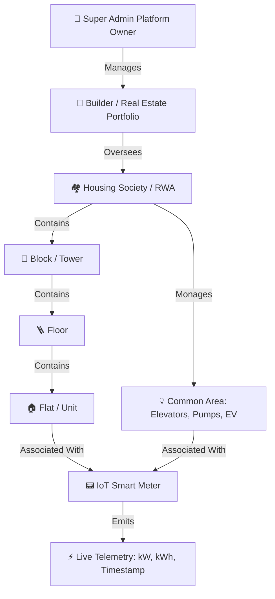
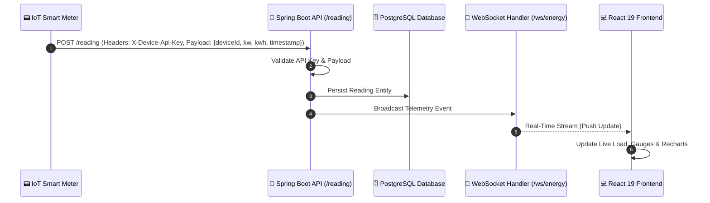

# ⚡ Enera — Smart IoT Energy Consumption & Management Platform

[](https://openjdk.org/)
[](https://spring.io/projects/spring-boot)
[](https://react.dev/)
[](https://www.typescriptlang.org/)
[](https://tailwindcss.com/)
[](https://www.postgresql.org/)
[](https://www.docker.com/)
[](LICENSE)

**Enera** is an enterprise-grade IoT smart metering and energy management platform designed for housing societies, gated communities, commercial complexes, and real estate builder portfolios. It delivers real-time smart meter telemetry ingestion, multi-tenant hierarchical infrastructure management, automated anomaly detection, role-based dashboards, and interactive power analytics.

---

## 📑 Table of Contents

- [Key Highlights](#-key-highlights)
- [Architecture & Hierarchy](#-architecture--hierarchy)
- [Role-Based Access Control (RBAC)](#-role-based-access-control-rbac)
- [Technology Stack](#-technology-stack)
- [System Features](#-system-features)
  - [1. Real-Time Telemetry & Smart Metering](#1-real-time-telemetry--smart-metering)
  - [2. Hierarchical Infrastructure Management](#2-hierarchical-infrastructure-management)
  - [3. Deep Analytics & Insights](#3-deep-analytics--insights)
  - [4. Resident Self-Service](#4-resident-self-service)
  - [5. Device Commissioning & Health Monitoring](#5-device-commissioning--health-monitoring)
- [Project Structure](#-project-structure)
- [API Reference](#-api-reference)
- [Getting Started](#-getting-started)
  - [Prerequisites](#prerequisites)
  - [Quick Start with Docker Compose](#quick-start-with-docker-compose)
  - [Manual Local Setup](#manual-local-setup)
- [Environment Configuration](#-environment-configuration)
- [Demo Credentials](#-demo-credentials)
- [Design System — Arcadia](#-design-system--arcadia)

---

## 🌟 Key Highlights

- **Multi-Tenant Hierarchy:** Structured data modeling: `Builder` ➔ `Society` ➔ `Block` ➔ `Floor` ➔ `Flat` / `Common Area` ➔ `Smart Meter (Device)` ➔ `Readings (kW / kWh)`.
- **Real-Time Telemetry Streaming:** Live WebSocket pipelines delivering instantaneous power load updates (`kW`) and cumulative consumption (`kWh`) directly to frontend dashboards.
- **Strict Role-Based Access Control (RBAC):** Tailored experiences and security boundaries across Super Admins, Builder Executives, Society Managers, and Residents.
- **Arcadia Design System:** Clean, modern, high-contrast user interface built with Tailwind CSS v4, zero drop-shadow flat elevation, and curated nature-inspired palettes.
- **Device Provisioning & Commissioning:** Lifecycle management for IoT smart meters, supporting installation tracking, floor/flat reassignments, and offline state detection.
- **Interactive Analytics Engine:** Rich data visualizations powered by Recharts (24-hour date-picker profiles, heatmaps, peak demand analytics, and portfolio benchmarks).

---

## 🏛️ Architecture & Hierarchy



### Telemetry Pipeline


---

## 👥 Role-Based Access Control (RBAC)

Enera implements 4 distinct roles, each mapped to specific security contexts and UI views:

| Role | Target Persona | Scope of Access | Primary Dashboard |
|---|---|---|---|
| `SUPER_ADMIN` | System Owner / Platform Engineer | Complete platform oversight: builder creation, global metrics, global society health. | `/superAdmin/:id` |
| `BUILDER_ADMIN` | Real Estate Developer / Portfolio Exec | Aggregated portfolio performance, cross-society benchmarking, high-level energy metrics. | `/builder/:id`, `/builder/:id/analytics` |
| `SOCIETY_ADMIN` | Society RWA / Facility Manager | Single-society drilldown: block/floor/flat structure, resident directory, device commissioning, alerts, billing. | `/society/:id`, `/society/:id/devices` |
| `RESIDENT` | Flat Owner / Tenant | Flat-specific live power draw, historical 24-hour date-selected profile, weekly breakdown, meter status. | `/flat/:id` |

---

## 🛠️ Technology Stack

### Frontend
- **Framework:** [React 19](https://react.dev/) + [Vite 8](https://vitejs.dev/)
- **Language:** [TypeScript 6](https://www.typescriptlang.org/)
- **Styling & Tokens:** [Tailwind CSS v4](https://tailwindcss.com/) with Arcadia custom design tokens
- **Data Visualization:** [Recharts 3](https://recharts.org/)
- **Icons & UI Primitives:** [Lucide React](https://lucide.dev/), [Radix UI](https://www.radix-ui.com/) (Dropdowns, Tabs, Tooltips)
- **Routing & State:** [React Router 7](https://reactrouter.com/), Context API (`AuthContext`, `WebSocketContext`), [Zustand](https://github.com/pmndrs/zustand)
- **HTTP & Live Client:** [Axios](https://axios-http.com/), Native WebSocket client

### Backend
- **Framework:** [Spring Boot 4.0.7](https://spring.io/projects/spring-boot)
- **Runtime:** [Java 21 (LTS)](https://openjdk.org/)
- **Security:** Spring Security + Stateless JWT (`jjwt 0.12.7`) + BCrypt password hashing
- **Persistence & ORM:** Spring Data JPA + Hibernate with PostgreSQL Dialect
- **Database:** [PostgreSQL 16](https://www.postgresql.org/)
- **Real-Time Engine:** Spring WebSocket (`@EnableWebSocket` + custom `WebSocketHandler`)
- **Productivity:** Lombok, Jakarta Validation

### Infrastructure & DevOps
- **Containerization:** Docker & Multi-stage Dockerfiles
- **Orchestration:** Docker Compose
- **Web Server (Production Frontend):** Nginx Alpine
- **Cloud Hosting:** Backend & DB on Render, Frontend on Vercel

---

## 🚀 System Features

### 1. Real-Time Telemetry & Smart Metering
- High-frequency IoT telemetry capture via authenticated REST endpoint (`/reading`).
- Live distribution of power load (`kW`) and cumulative consumption (`kWh`) over WebSocket connections (`/ws/energy`).
- Automatic time-stamped persistence and device telemetry aggregation.

### 2. Hierarchical Infrastructure Management
- **Society Builder & Structure:** Create and manage residential towers/blocks, customize floor counts, and allocate apartments.
- **Flat Management:** Track flat numbers, configuration (1BHK, 2BHK, 3BHK, etc.), and occupancy states (`Occupied` vs. `Vacant`).
- **Common Area Tracking:** Dedicated monitoring for elevators, water pumping systems, clubhouse amenities, and EV charging points.
- **Cascade Deletion Safety:** Clean cascading lifecycle handling across builders, societies, towers, floors, and individual meters.

### 3. Deep Analytics & Insights
- **Date-Selected Hourly Profile:** Interactive calendar picker on the resident dashboard allows querying and inspecting hourly energy signatures for any specific day.
- **Heatmaps & Peak Load Analysis:** Visualize time-of-day consumption hotspots to detect peak demand and inefficiencies.
- **Portfolio Benchmarking:** Builder-level analytics comparing energy efficiency across different societies.

### 4. Resident Self-Service
- Personalized dashboard for flat owners.
- Real-time power load dial and current active consumption status.
- Daily, weekly, and monthly consumption breakdowns.
- Self-service password updates and credential management.

### 5. Device Commissioning & Health Monitoring
- Centralized smart meter inventory (`/society/:id/devices`).
- Cascading Block $\rightarrow$ Floor $\rightarrow$ Flat / Common Area picker for device provisioning.
- Instantaneous meter status indicators (`ONLINE`, `OFFLINE`, `FAULT`).
- Safe device decommissioning and deregistration.

---

## 📁 Project Structure

```
Energy/
├── .github/                       # CI/CD workflows and actions
├── backend/                       # Spring Boot 4 Application
│   ├── src/main/java/com/enera/backend/
│   │   ├── config/                # Application & CORS configurations
│   │   ├── controller/            # REST API endpoints
│   │   ├── dto/                   # Request/Response Data Transfer Objects
│   │   ├── entity/                # JPA Database Entities
│   │   ├── exception/             # Global exception handlers & error schemas
│   │   ├── mapper/                # Entity <-> DTO converters
│   │   ├── repository/            # Spring Data JPA repositories
│   │   ├── security/              # JWT filter, auth providers, SecurityConfig
│   │   ├── service/               # Core business logic layer
│   │   ├── websocket/             # Live telemetry WebSocket handler
│   │   └── BackendApplication.java# Application main entry point
│   ├── src/main/resources/
│   │   └── application.properties # Spring configuration & environment variables
│   ├── Dockerfile                 # Multi-stage Java build
│   └── pom.xml                    # Maven dependencies & build plugins
├── frontend/                      # React 19 + TypeScript + Vite Application
│   ├── src/
│   │   ├── api/                   # Axios client instance & interceptors
│   │   ├── app/
│   │   │   ├── login/             # Login views
│   │   │   └── dashboard/         # Role-based dashboard views
│   │   │       ├── SocietyAdminDashboard.tsx
│   │   │       ├── FlatOwnerDashboard.tsx
│   │   │       ├── BuilderAdminDashboard.tsx
│   │   │       ├── BuilderAnalytics.tsx
│   │   │       ├── SuperAdminDashboard.tsx
│   │   │       └── DeviceManagement.tsx
│   │   ├── components/            # Reusable UI components, Modals, Layouts, Charts
│   │   ├── context/               # AuthContext & WebSocketContext
│   │   ├── lib/                   # API bindings, TypeScript types & utility helpers
│   │   ├── index.css              # Arcadia design system tokens (@theme)
│   │   └── App.tsx                # App router & RBAC route gates
│   ├── Dockerfile                 # Multi-stage Vite + Nginx build
│   ├── nginx.conf                 # Nginx SPA reverse proxy & static routing
│   └── package.json               # Frontend dependencies & scripts
├── docker-compose.yml             # Full-stack local orchestration
├── SeedData.sql                   # Database initialization & mock seed script
└── README.md                      # Project documentation
```

---

## 📡 API Reference

### 🔐 Authentication & Profile (`/auth`, `/user`)
| Method | Endpoint | Access | Description |
|---|---|---|---|
| `POST` | `/auth/login` | Public | Authenticates credentials and returns JWT bearer token + user context |
| `POST` | `/auth/register` | Public / Admin | Registers a new resident or user |
| `PATCH` | `/user/change-password` | Authenticated | Updates current user password |

### ⚡ IoT Smart Meter Telemetry (`/reading`, `/ws`)
| Method | Endpoint | Access | Description |
|---|---|---|---|
| `POST` | `/reading` | IoT Device (`X-Device-Api-Key`) | Ingests a new meter reading (`kw`, `kwh`, `timestamp`) and triggers live broadcast |
| `WS` | `/ws/energy` | Authenticated / Public | Real-time WebSocket connection streaming live energy readings |

### 👑 Super Admin Operations (`/superAdmin`)
| Method | Endpoint | Access | Description |
|---|---|---|---|
| `GET` | `/superAdmin/stats` | `SUPER_ADMIN` | Platform-wide metrics (total builders, societies, active devices) |
| `GET` | `/superAdmin/builders` | `SUPER_ADMIN` | Lists all onboarded real estate builders |
| `POST` | `/superAdmin/builders` | `SUPER_ADMIN` | Provisions a new builder organization |
| `DELETE` | `/superAdmin/builders/{id}` | `SUPER_ADMIN` | Cascade-deletes a builder and associated societies |

### 🏢 Builder Operations (`/builder`)
| Method | Endpoint | Access | Description |
|---|---|---|---|
| `GET` | `/builder/{id}/dashboard` | `BUILDER_ADMIN`, `SUPER_ADMIN` | Aggregated portfolio stats & society cards |
| `GET` | `/builder/{id}/societies` | `BUILDER_ADMIN`, `SUPER_ADMIN` | Lists all societies owned by the builder |
| `POST` | `/builder/{id}/society` | `BUILDER_ADMIN`, `SUPER_ADMIN` | Creates a new society under the builder organization |
| `DELETE` | `/builder/{builderId}/society/{societyId}` | `BUILDER_ADMIN`, `SUPER_ADMIN` | Cascade-deletes a society |

### 🏘️ Society Operations (`/society`)
| Method | Endpoint | Access | Description |
|---|---|---|---|
| `GET` | `/society/{id}/dashboard` | `SOCIETY_ADMIN`, `BUILDER_ADMIN` | Society overview stats, energy summary & block count |
| `GET` | `/society/{id}/blocks` | `SOCIETY_ADMIN`, `BUILDER_ADMIN` | Retrieves society block & floor structure |
| `POST` | `/society/{id}/block` | `SOCIETY_ADMIN` | Adds a new block/tower to the society |
| `DELETE` | `/society/{id}/block/{blockId}` | `SOCIETY_ADMIN` | Deletes a block and child floors/flats |
| `GET` | `/society/{id}/residents` | `SOCIETY_ADMIN` | Fetches directory of registered residents |
| `POST` | `/society/{id}/resident` | `SOCIETY_ADMIN` | Onboards a resident and assigns to a flat |
| `DELETE` | `/society/{id}/resident/{residentId}` | `SOCIETY_ADMIN` | Offboards a resident and marks flat vacant |
| `GET` | `/society/{id}/devices` | `SOCIETY_ADMIN` | Lists all smart meters, installation targets, and health |
| `POST` | `/society/{id}/device` | `SOCIETY_ADMIN` | Provisions and commissions a smart meter |
| `DELETE` | `/device/{id}` | `SOCIETY_ADMIN` | Deregisters and unbinds a smart meter |
| `GET` | `/society/{id}/common-areas` | `SOCIETY_ADMIN` | Lists common utility meters (elevators, pumps, EV) |
| `POST` | `/society/{id}/common-area` | `SOCIETY_ADMIN` | Adds a monitored common utility area |
| `DELETE` | `/society/{societyId}/common-area/{id}` | `SOCIETY_ADMIN` | Deletes a common utility area |

### 🏠 Flat & Floor Operations (`/flat`, `/floor`, `/block`)
| Method | Endpoint | Access | Description |
|---|---|---|---|
| `GET` | `/flat/{id}/dashboard` | `RESIDENT`, `SOCIETY_ADMIN` | Real-time flat load, daily/weekly stats, meter state |
| `GET` | `/flat/{id}/readings/hourly?date=YYYY-MM-DD` | `RESIDENT`, `SOCIETY_ADMIN` | 24-hour hourly consumption profile for a selected date |
| `POST` | `/floor/{floorId}/flat` | `SOCIETY_ADMIN` | Adds a new apartment to a floor |
| `DELETE` | `/floor/{floorId}/flat/{flatId}` | `SOCIETY_ADMIN` | Removes a flat from a floor |
| `POST` | `/block/{blockId}/floor` | `SOCIETY_ADMIN` | Adds a new floor to a block |
| `DELETE` | `/block/{blockId}/floor/{floorId}` | `SOCIETY_ADMIN` | Deletes a floor and its flats |

---

## 💻 Getting Started

### Prerequisites
- **Java:** JDK 21 or higher installed
- **Node.js:** v20.x or higher + `npm`
- **Database:** PostgreSQL 16+ (or use Docker)
- **Containerization (Optional):** Docker & Docker Compose

---

### Quick Start with Docker Compose

The fastest way to spin up the entire Enera platform (PostgreSQL + Spring Boot Backend + React Frontend):

```bash
# 1. Clone the repository
git clone https://github.com/Rishabh-020/Enera.git
cd Enera

# 2. Launch all services via Docker Compose
docker-compose up --build -d

# 3. Verify running containers
docker-compose ps
```

Once running:
- **Frontend:** [http://localhost:3000](http://localhost:3000)
- **Backend API:** [http://localhost:8080](http://localhost:8080)
- **PostgreSQL Database:** `localhost:5432` (`energy_db` / `postgres` / `postgres`)

To stop the services:
```bash
docker-compose down
```

---

### Manual Local Setup

#### 1. Database Setup
Create a PostgreSQL database named `energy_db`:
```sql
CREATE DATABASE energy_db;
```

Optionally seed the database with demo buildings, users, devices, and readings:
```bash
psql -U postgres -d energy_db -f SeedData.sql
```

#### 2. Backend Setup
1. Navigate to the backend directory:
   ```bash
   cd backend
   ```
2. Configure your database credentials in `src/main/resources/application.properties` or create a `.env.properties` file in `backend/`:
   ```properties
   DB_URL=jdbc:postgresql://localhost:5432/energy_db
   DB_USERNAME=postgres
   DB_PASSWORD=your_password
   JWT_SECRET=be61b302de82925ad8b698b033ac359a667515ff6203c0720b307732acdb0e6d
   SERVER_PORT=8080
   ```
3. Run the Spring Boot application:
   ```bash
   # Linux/macOS
   ./mvnw spring-boot:run

   # Windows
   .\mvnw.cmd spring-boot:run
   ```
   The backend API will start on `http://localhost:8080`.

#### 3. Frontend Setup
1. Navigate to the frontend directory:
   ```bash
   cd frontend
   ```
2. Create or verify `.env`:
   ```env
   VITE_API_BASE_URL=http://localhost:8080
   ```
3. Install dependencies and start the Vite development server:
   ```bash
   npm install
   npm run dev
   ```
4. Open [http://localhost:5173](http://localhost:5173) in your browser.

---

## ⚙️ Environment Configuration

### Backend (`backend/src/main/resources/application.properties` or `backend/.env.properties`)
| Variable | Default Value | Description |
|---|---|---|
| `SERVER_PORT` / `PORT` | `8080` | Port on which the Spring Boot server listens |
| `DB_URL` | `jdbc:postgresql://localhost:5432/energy_db` | JDBC connection URL for PostgreSQL |
| `DB_USERNAME` | `postgres` | PostgreSQL username |
| `DB_PASSWORD` | `postgres` | PostgreSQL password |
| `JWT_SECRET` | *32+ byte hex string* | HMAC-SHA secret used for signing JWT tokens |
| `FRONTEND_URL` | `https://enera-steel.vercel.app` | Allowed CORS origin for frontend client |
| `IOT_API_KEY` | `enera-iot-secure-key-2026` | API key required in `X-Device-Api-Key` header for IoT ingestion |

### Frontend (`frontend/.env` / `frontend/.env.production`)
| Variable | Description | Example |
|---|---|---|
| `VITE_API_BASE_URL` | Base HTTP URL for the Spring Boot backend | `http://localhost:8080` / `https://api.yourdomain.com` |
| `VITE_WS_URL` | WebSocket URL for live telemetry streaming | `ws://localhost:8080/ws/energy` / `wss://api.yourdomain.com/ws/energy` |

---

## 🔑 Demo Credentials

When initialized with [SeedData.sql](SeedData.sql), you can log in using any of the following pre-configured user accounts:

| Role | Email | Password | Scope / Permissions |
|---|---|---|---|
| **Super Admin** | `superadmin@enera.com` | `Super@Admin2007` | Platform-level management, all builders & societies |
| **Builder Admin** | `builder1@enera.com` | `builder1@Admin2007` | Prestige Builders portfolio overview & societies |
| **Builder Admin** | `builder2@enera.com` | `builder2@Admin2007` | DLF Smart Infrastructure portfolio overview |
| **Society Admin** | `society1@enera.com` | `society1@Admin2007` | Green Valley Residency society management |
| **Society Admin** | `society2@enera.com` | `society2@Admin2007` | Sky Heights Apartments society management |
| **Resident** | `owner001@enera.com` | `user1@user2007` | Flat 101 resident energy dashboard |

---

## 🎨 Design System — Arcadia

Enera is built on the **Arcadia Design System**, prioritizing clean data density, crisp typography, and flat surfaces:

| Token Name | Hex Code | Purpose |
|---|---|---|
| `color-canopy` | `#104336` | Sidebar, primary brand actions, top-level navigation |
| `color-mint-pulse` | `#0fff87` | Vibrant accent (active indicators, primary call-to-action) |
| `color-cream-paper` | `#f3f1ec` | Canvas & page background |
| `color-sheet-white` | `#ffffff` | Elevated cards, dialogs, and topbar panels |
| `color-bark` | `#101f1e` | High-contrast primary typography |
| `color-sage-mist` | `#afc4bf` | Hairline card borders (1px solid, zero drop-shadows) |
| `color-slate` | `#535e5d` | Secondary subtitles and metadata labels |
| `color-orb-violet` | `#7c18d3` | Chart highlights & telemetry metrics |

---

## 📄 License

This project is licensed under the [MIT License](LICENSE).
